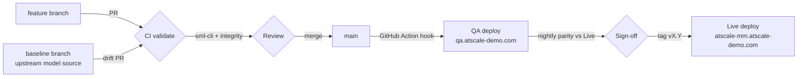

# CI/CD Process — High Level

How a change travels from a developer's branch to the Live AtScale instance.
The SML repository **is** the deployable artifact (GitOps): nothing is compiled;
a deployment is `sml-cli atscale-deploy` of a git ref to an AtScale instance.
Endpoints per environment: `config/environment.yml`. Branch model in detail:
`docs/GIT_PROCESS.md`.

## Stages

| # | Stage | Trigger | Runs where | Gate / output |
|---|---|---|---|---|
| 1 | **Validate** | every PR; push to `main`/`baseline` | GitHub Actions (`validate.yml`) — repo-only, no system access | `sml-cli validate` + cross-reference integrity must pass |
| 2 | **Review** | PR open | GitHub branch protection | Required review before merge |
| 3 | **Dev sandbox** | manual per branch | Airflow (`sml_deploy_dev`) | Feature branch lands as its own catalog on Development |
| 4 | **Deploy to QA** | merge to `main` (GitHub Action → Airflow REST) | Airflow (`sml_deploy_qa`) | `sml-cli atscale-deploy` to QA + smoke check; status posted back to the commit (`atscale/deploy-qa`) |
| 5 | **Regression** | nightly | Airflow (`sml_regression_nightly`) | Canned queries QA vs Live must match |
| 6 | **Release to Live** | git tag `vX.Y` (manual, gated) | Airflow (`sml_release_live`) | Tagged ref deployed to Live |

Two producer flows feed the same pipeline:

- **Human changes** (model edits, new metrics): feature branch → stages 1–6.
- **Machine changes**: the weekly `baseline_refresh` DAG re-syncs the upstream
  model source to `baseline` and opens the drift PR; `usage_trace_ingest`
  refreshes the priority backlog as a PR. Both enter at stage 1 like any other
  change — nothing reaches `main` without validation and review.

## Environment promotion

| Environment | Host | Namespace | What lands there | How |
|---|---|---|---|---|
| Development | `dev.atscale-demo.com` | `atscale-dev` | feature-branch catalogs | manual / Airflow per branch |
| QA | `qa.atscale-demo.com` | `atscale-qa` | every `main` commit | automatic on merge |
| Live | `atscale-mm.atscale-demo.com` | `atscale` | tagged releases | manual, tag-gated |

Promotion is by **git ref, not artifact copy** — QA and Live always correspond
to an exact commit/tag, so "what is deployed" is answered by `git log`.

## Rollback

Redeploy the previous tag (trigger `sml_release_live` with `vX.Y-1`). Because
deployments are declarative and the repo is the source of truth, rollback is
the same operation as release — no snapshots or restores involved.

## Secrets & access

- GitHub Actions runs repo-only checks and holds **no** AtScale credentials.
- All system credentials live in Kubernetes secrets in the `airflow` namespace
  (`atscale-{dev,qa,live}-api`, `github-token`); Airflow reports results back
  to commits via the GitHub status API.
- `config/environment.yml` carries endpoints only — never secrets.

## Definition of "deployable"

`main` must always validate cleanly and deploy to QA without manual steps. If
a change needs coordination (e.g. a warehouse view landing first), the PR
stays open until the dependency is met.
